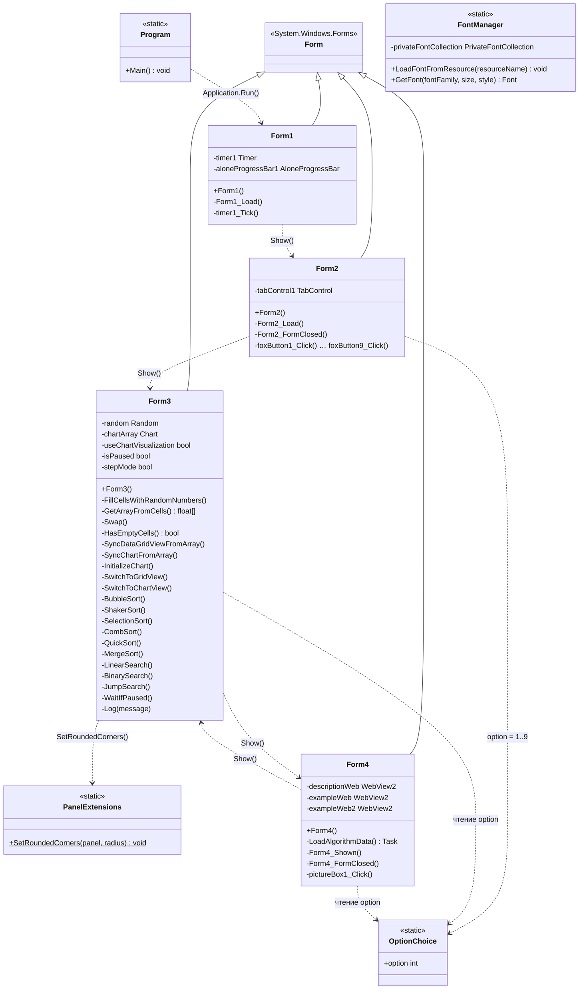
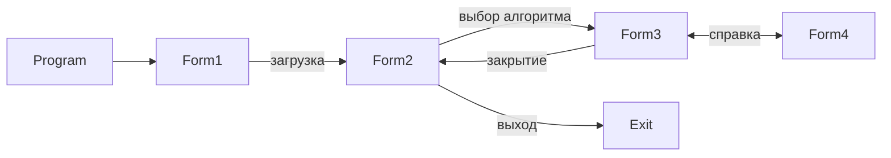

# Диаграмма классов — электронный образовательный ресурс

## Рисунок — Диаграмма классов программного продукта

```mermaid
classDiagram
    direction TB

    class Form {
        <<System.Windows.Forms>>
    }

    class Program {
        <<static>>
        +Main() void
    }

    class FontManager {
        <<static>>
        -privateFontCollection PrivateFontCollection
        +LoadFontFromResource(resourceName) void
        +GetFont(fontFamily, size, style) Font
    }

    class OptionChoice {
        <<static>>
        +option int
    }

    class PanelExtensions {
        <<static>>
        +SetRoundedCorners(panel, radius)$ void
    }

    class Form1 {
        -timer1 Timer
        -aloneProgressBar1 AloneProgressBar
        +Form1()
        -Form1_Load()
        -timer1_Tick()
    }

    class Form2 {
        -tabControl1 TabControl
        +Form2()
        -Form2_Load()
        -Form2_FormClosed()
        -foxButton1_Click() … foxButton9_Click()
    }

    class Form3 {
        -random Random
        -chartArray Chart
        -useChartVisualization bool
        -isPaused bool
        -stepMode bool
        +Form3()
        -FillCellsWithRandomNumbers()
        -GetArrayFromCells() float[]
        -Swap()
        -HasEmptyCells() bool
        -SyncDataGridViewFromArray()
        -SyncChartFromArray()
        -InitializeChart()
        -SwitchToGridView()
        -SwitchToChartView()
        -BubbleSort()
        -ShakerSort()
        -SelectionSort()
        -CombSort()
        -QuickSort()
        -MergeSort()
        -LinearSearch()
        -BinarySearch()
        -JumpSearch()
        -WaitIfPaused()
        -Log(message)
    }

    class Form4 {
        -descriptionWeb WebView2
        -exampleWeb WebView2
        -exampleWeb2 WebView2
        +Form4()
        -LoadAlgorithmData() Task
        -Form4_Shown()
        -Form4_FormClosed()
        -pictureBox1_Click()
    }

    Form <|-- Form1
    Form <|-- Form2
    Form <|-- Form3
    Form <|-- Form4

    Program ..> Form1 : Application.Run()
    Form1 ..> Form2 : Show()
    Form2 ..> Form3 : Show()
    Form2 ..> OptionChoice : option = 1..9
    Form3 ..> Form4 : Show()
    Form4 ..> Form3 : Show()
    Form3 ..> OptionChoice : чтение option
    Form4 ..> OptionChoice : чтение option
    Form3 ..> PanelExtensions : SetRoundedCorners()
```

## Навигация между формами

```mermaid
flowchart LR
    Program --> Form1
    Form1 -->|загрузка| Form2
    Form2 -->|выбор алгоритма| Form3
    Form3 <-->|справка| Form4
    Form3 -->|закрытие| Form2
    Form2 -->|выход| Exit
```
